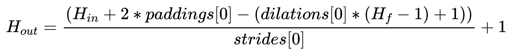

# 卷积类型

## convolution2D类型
```text
H_{out}= \frac{(H_{in} + 2 * paddings[0] - (dilations[0] * (H_f - 1) + 1))}{strides[0]} + 1
W_{out}= \frac{(W_{in} + 2 * paddings[1] - (dilations[1] * (W_f - 1) + 1))}{strides[1]} + 1
```



## 参考链接
* 1 [神经网络参数概念定义](http://ufldl.stanford.edu/tutorial/supervised/MultiLayerNeuralNetworks/)
