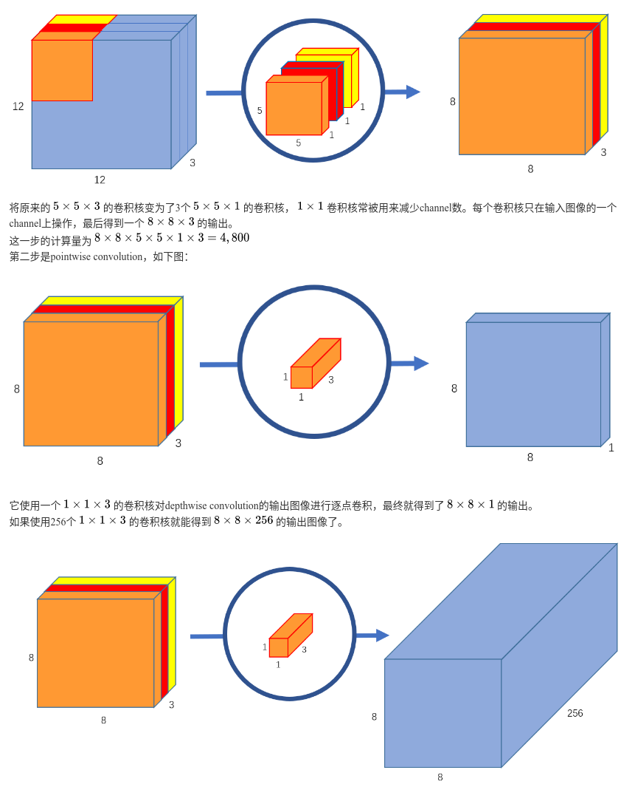
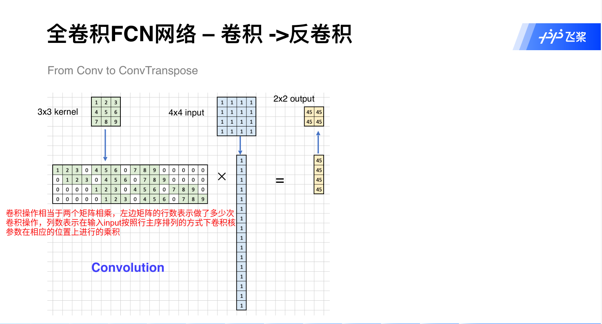
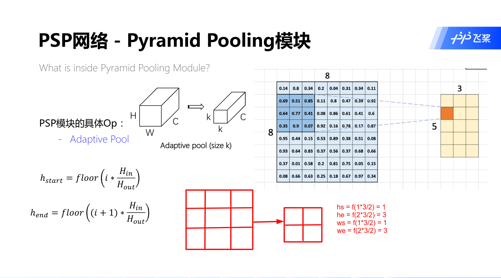
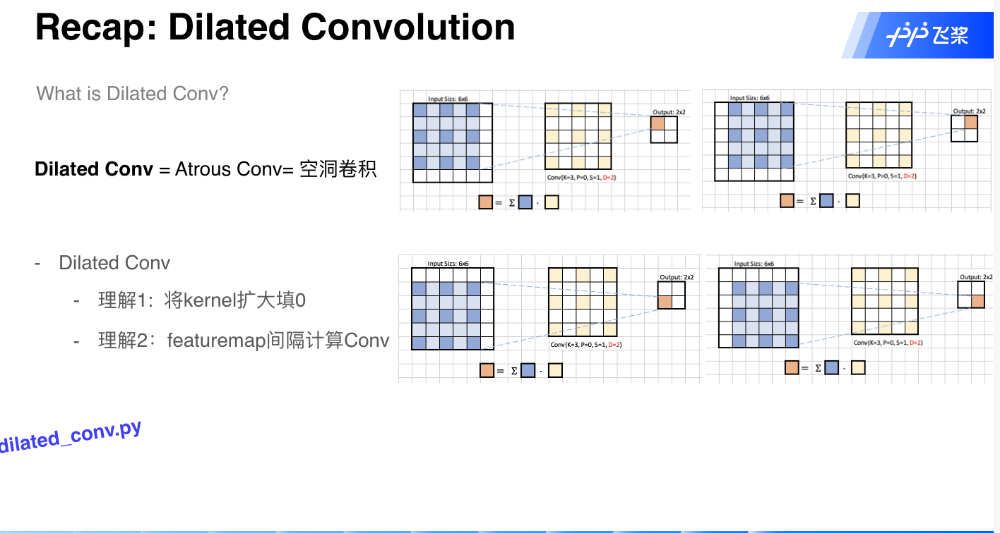
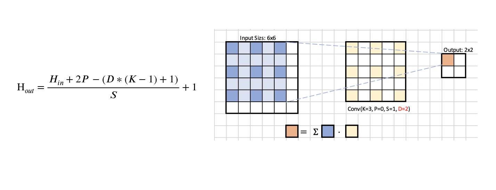

# common.py代码解析
## FLOPs概念
* 标准CNN的FLOPs计算：
```text
FLOPs = [Cin * K * K + Cin * (K * K - 1) + (Cin -1) + 1] * Cout * Hout * Wout
      = [2 * Cin * K * K] * Cout * Hout * Wout
Cin     : 输入数据的通道数
K       : 卷积核尺寸大小
Cout    : 输出数据的通道数
Hout    : 输出数据的高
Wout    : 输出数据的宽        
```
* `Cout*Hout*Wout`表示输出特征维度尺寸大小，其中的每一个元素是在输入数据上做了`Cin*K*K`浮点运算次数（加法+乘法）
`Cin*K*K`表示每一个通道上做了`K*K`此乘法运算，`Cin * (K * K - 1)`表示每一个通道上做了`(K*K-1)`次加法
`(Cin -1)`表示对每一个通道做完卷积操作进行求和，`1` 表示通道上的卷积操作完成以后再加上偏置项

## Focus结构
* 对输入图像的每一通道做切片操作，变成4个原输入大小一半的4个切片，3个通道切片后加在一起即是12个切片
* 该模块的设计主要是减少原始信息的丢失，减少计算量加快模型推理速度


## 深度可分离卷积
* 深度可分离卷积将一般的卷积过程分为了`depthwise convolution`（逐深度卷积）和`pointwise convolution`（逐点卷积），  
  `depthwise convolution`逐深度卷积表示分别在每个输入通道上做卷积，输出通道数与输入通道数相同，
  `pointwise convolution`逐点卷积表示使用`1*1`的卷积核在输入通道上进行普通卷积操作，
* 在损失一点精度的情况下，计算量大幅下降，速度更快，模型更小
```text
c1           : 输入通道数
c2           : 输出通道数
卷积核大小    : k*k
普通卷积的参数量 : c1*k*k*c2
深度可分离卷积的参数量 : c1*k*k + c1*1*1*c2
```

  
  
## 分组卷积
```text
c1           : 输入通道数
c2           : 输出通道数
分组数        : g
卷积核大小    : k*k
普通卷积的参数量 : c1*k*k*c2
分组卷积的参数量 : (c1/g)*k*k*(c2/g)*g
```
* `(c1/g)*k*k*(c2/g)`表示的是一个普通卷积的参数量，即分组卷积中的每一个小组的卷积参数量


```text
分组卷积的分组数如果和输入的通道数相同，则此时的分组卷积即为深度可分离卷积
```
## 卷积操作的矩阵表示

 

## 自适应池化操作
`hs,he,ws,we`表示进行池化操作的窗口大小以及起始点和重点坐标位置  



## 空洞卷积`Dilated Conv`
* 空洞卷积可以扩大卷积之后的感受野信息，进而获取更多的上下文信息，同时不增加参数数量  
空洞卷积的操作相当于扩大了卷积核的大小，扩充的地方进行补零操作
  
* 空洞卷积输出大小的计算公式
  


## 参考链接
* 1 [Focus结构](https://zhuanlan.zhihu.com/p/172121380)
* 2 [Focus结构](https://mp.weixin.qq.com/s/yO13BjSNG1cEDAxqR-SkHw)
* 3 [深度可分离卷积](https://www.cnblogs.com/sddai/p/14549475.html)
* 4 [分组卷积](https://blog.csdn.net/breeze_blows/article/details/98068025)
* 5 [common.py代码解析](https://blog.csdn.net/qq_38253797/article/details/119684388)
* 6 [same卷积](https://blog.csdn.net/u012370185/article/details/95238828)


