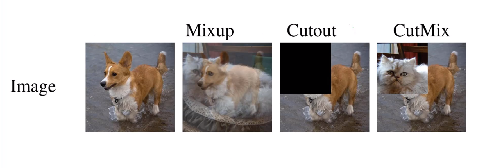
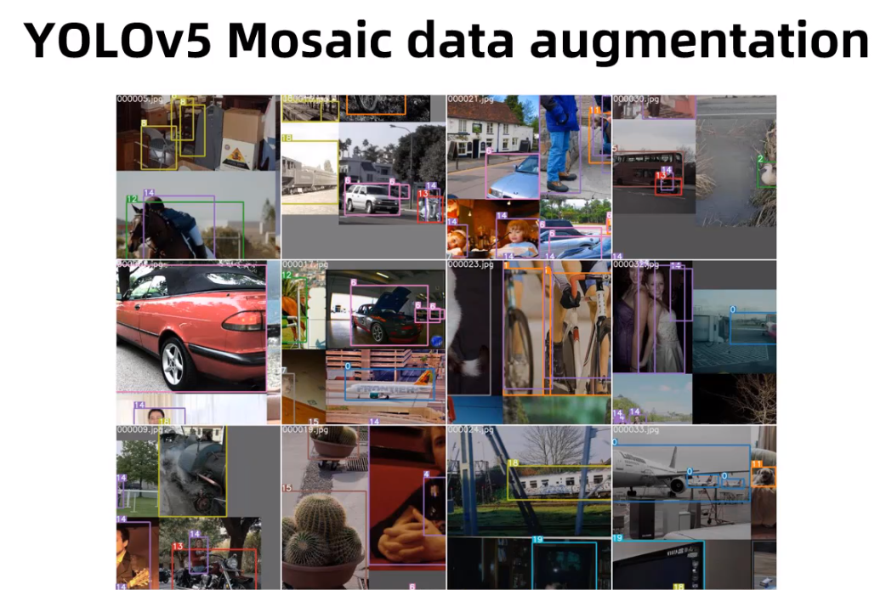
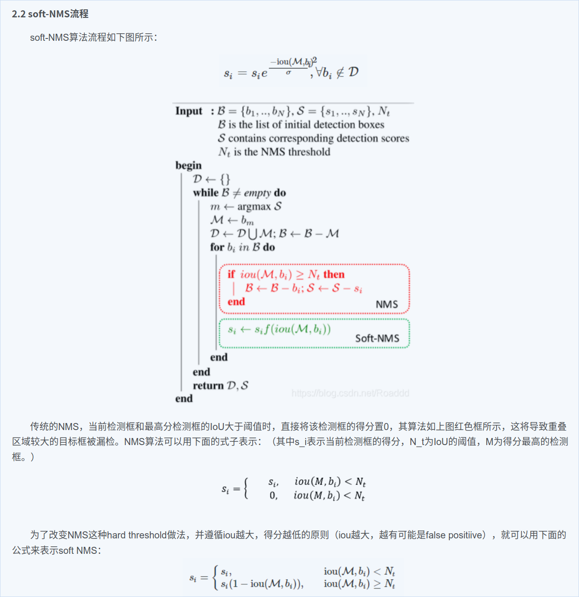

# augmentations.py代码解析

## letterbox
* 输入图像自适应缩放，目的是为了最大程度减少输入图像的黑边进而提升模型的推理速度

## mixup and cutout 数据增强

## mosic 数据增强

## nms非极大值抑制
* 之前的nms策略是直接把与置信度最大的候选框的重叠面积超过指定阈值的候选框过滤掉，
  而使用soft nms策略可以把与置信度最大的候选框的重叠度较高的候选框保留下来，
  放在下一次的nms操作流程

## 参考链接
* 1 [输入图像自适应缩放](https://zhuanlan.zhihu.com/p/172121380)
* 1 [输入图像自适应缩放](https://www.jiangdabai.com/2117)
