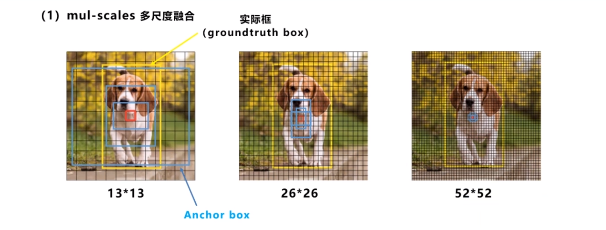

# autoanchor.py代码解析

## anchor锚框
* 锚框通过与目标框做iou来判断选择哪一个锚框来计算预测框，进而通过锚框来得到预测框
* 单目标不需要锚框，在多目标检测的情况下需要锚框，选择锚框中与目标框的iou值最大的那一个来计算预测框的信息，
* 不同尺度下的网格单元都有三个锚框，然后选择一个与目标框的iou最大的来计算预测框的信息，进而计算目标框与预测框的损失
* 特征图能够和原图位置对应起来

* 黄色的锚框是蓝色的预测框与红色的目标框之间联系的桥梁，被目标框通过与锚框计算iou而选中的锚框通过公式计算出预测框的位置信息，进而计算出目标框与预测框之间的loss

  

## check_anchors计算流程

## 参考链接
* 1 

