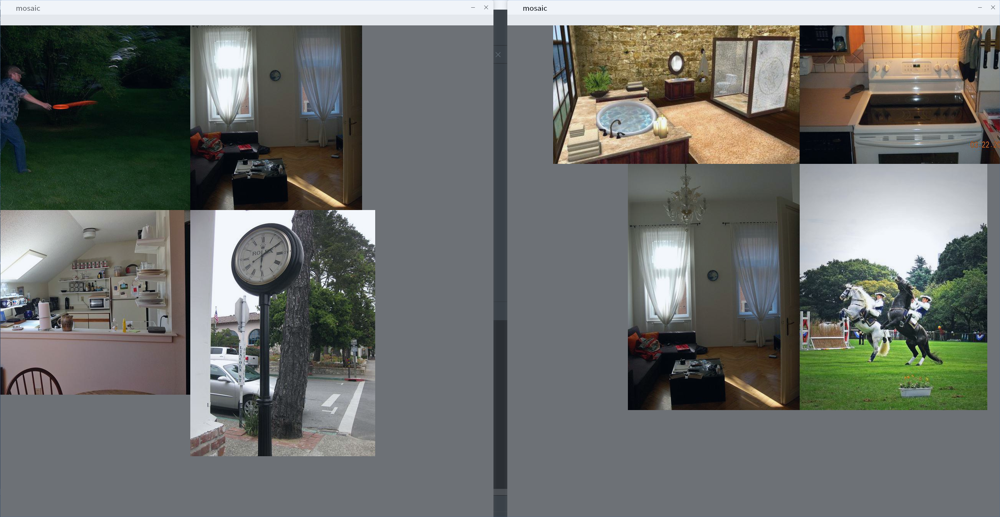
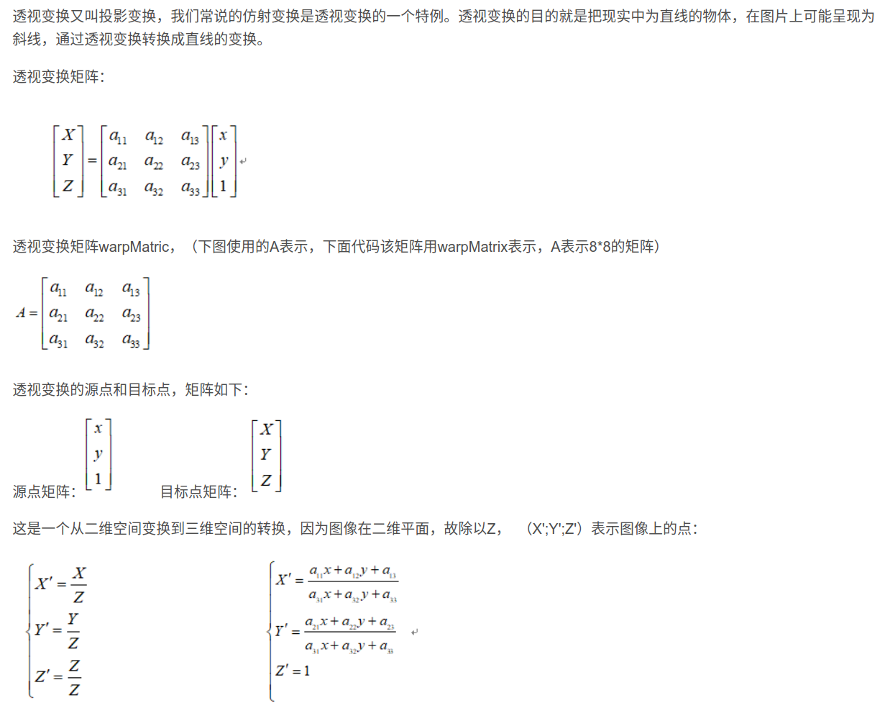
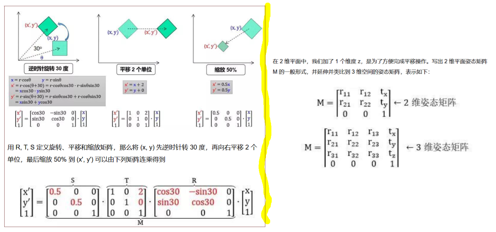

# datasets.py代码解析

## load_mosaic数据增强

* 随机初始化拼接图像的中心点坐标`(xc,yc)`，然后对随机选中的照片按照中心点坐标`(xc,yc)`，无缝拼接，并把多余的像素删除或者不够的像素使用
`114`像素值进行填充。
* 第一个被拼接的图像的右下角与拼接后的图像的中心点坐标`(xc,yc)`重合，
第二个被拼接的图像的左下角与拼接后的图像的中心点坐标`(xc,yc)`重合，
第三个被拼接的图像的右上角与拼接后的图像的中心点坐标`(xc,yc)`重合，
第四个被拼接的图像的左上角与拼接后的图像的中心点坐标`(xc,yc)`重合，
  
## random_perspective坐标矩阵变换
* 透视变换基本原理解释

* 仿射变换(旋转、平移、缩放)基本原理解释  
仿射变换是透视变换的一种，

## 参考链接
* 1 [random_perspective仿射变换](https://www.algorithm-archive.org/contents/affine_transformations/affine_transformations.html)