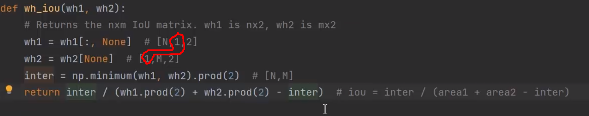

# main.py代码解析

## 计算iou
* 

## 参考链接
* 1 [如何使用k-means聚类得到anchors](https://www.bilibili.com/video/BV1Tv411T7qa)
* 2 [如何使用k-means聚类得到anchors](https://blog.csdn.net/qq_37541097/article/details/119647026)
* 3 [autoanchor.py代码解析](https://blog.csdn.net/qq_38253797/article/details/119713706)
