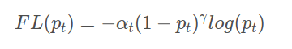
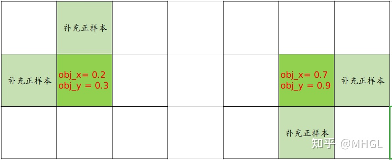

# loss.py代码解析

## 交叉熵
* 二分类交叉熵损失可理解为目标`是不是`，而交叉熵损失可理解为目标`是哪个`  
二元交叉熵损失把负样本也考虑了进来，同时使用focal_loss来优化正负样本的比重

## loss求解
* 框的预测值，以及目标框都要映射到特征层上，loss是在特征层上进行求解的，

## `FocalLoss`损失函数
* 使用了`nn.BCEWithLogitsLoss()=Sigmoid+BCELoss`  定义为多标签分类交叉熵损失函数  
比如使用`coco`数据集合进行训练，共有`80`类目标，对于长度为`80`的向量，每一个索引上的值表示该目标是正样本概率的预测值`p`，  
也即是负样本概率的预测值`1-p`，训练时对于每个类别的样本需要区分是正样本还是负样本，此长度为`80`的向量的和可能不是`1`，  
可能大于`1`，也可能小于`1`，
* 参数`α`调整的是负样本`loss`的权重，参数`γ`调整的是难易样本的`loss`占比  

## yolov5边框回归机制
* yolov5采用了跨邻域网格的正样本匹配策略，这样可以得到更多的正样本anchor，加速收敛

## ComputeLoss计算
* [BCEWithLogitsLoss](https://flyfish.blog.csdn.net/article/details/118909723)

## 浮点取模
* [浮点取模](https://flyfish.blog.csdn.net/article/details/119276814)

## 边框回归损失函数
* [边框回归损失函数](https://flyfish.blog.csdn.net/article/details/118858068)

## build_targets
* 扩充正样本机制
  
  
## 参考链接
* 1 [loss求解](https://mp.weixin.qq.com/s?__biz=MzU5NTg2MzIxMw==&mid=2247486712&idx=1&sn=f56a342fbba7b155f2dfdf84776ac17e&chksm=fe6a3f3ac91db62caefd100a712717fb0663b4066bdd64e2fdc7a80c526d7cbcf8d6f4aa6a94&scene=178&cur_album_id=1826437164776095749#rd)
* 2 [二分类交叉熵与交叉熵损失的通俗理解](https://zhuanlan.zhihu.com/p/339684056)
* 3 [yolov5的分类损失计算流程](https://blog.csdn.net/l13022736018/article/details/118346085)
* 4 [二元交叉熵损失](https://blog.csdn.net/qq_38253797/article/details/116225218)
* 5 [FocalLoss理解](https://blog.csdn.net/u014311125/article/details/109470137)
* 6 [熵的概念与公式解析](https://www.cnblogs.com/wangguchangqing/p/12068084.html#autoid-0-2-0)

