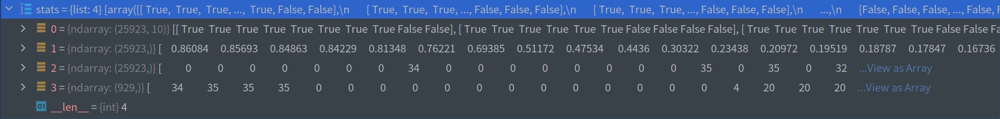

# metrics.py代码解析

## GIOU_Loss

## ap_per_class计算

* `tp, conf, pred_cls, target_cls = *stats`
```text
:params tp(correct): [pred_sum, 10]=[1905, 10] bool 整个数据集所有图片中所有预测框在每一个iou条件下(0.5~0.95)10个是否是TP
:params conf: [img_sum]=[1905] 整个数据集所有图片的所有预测框的conf
:params pred_cls: [img_sum]=[1905] 整个数据集所有图片的所有预测框的类别这里的tp、conf、pred_cls是一一对应的
:params target_cls: [gt_sum]=[929] 整个数据集所有图片的所有gt框的class
```


## 参考链接
* 1 [输入图像自适应缩放](https://www.jiangdabai.com/2120)